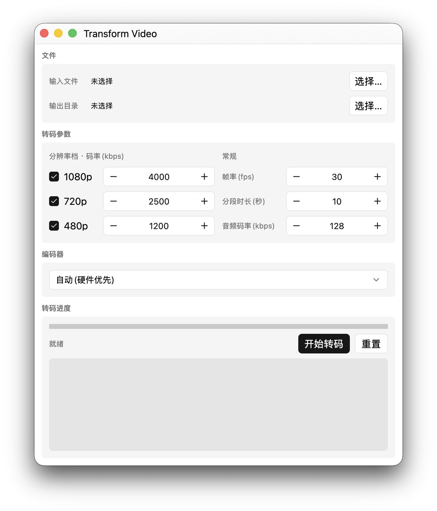

# Transform Video

[English](README.md) | [简体中文](README_ZH-CN.md)

A cross-platform desktop application for transcoding video into multi-bitrate
HLS streams on macOS and Windows. The interface is built with
[gpui-component](https://github.com/longbridge/gpui-component), and transcoding
is performed through the integrated FFmpeg libraries without invoking the
`ffmpeg` command-line tool.

<p align="center">
  
</p>

## Features

- Transcodes a single input into multi-variant HLS fMP4 output: 1080p, 720p,
  480p, an audio-only stream, and a master playlist
- Configurable resolution variants, bitrate for each variant, frame rate,
  segment duration, and audio bitrate
- Automatic hardware encoder detection: VideoToolbox on macOS; NVENC, AMF,
  QSV, and Media Foundation on Windows
- Falls back to `libx264` when no hardware encoder is available, with an option
  to force software encoding
- Displays progress, estimated time remaining, and logs
- Supports cancellation with automatic cleanup of incomplete segments
- Opens the output directory when transcoding completes

## Development

Requirements: the latest stable Rust toolchain. On macOS, install the build-time
FFmpeg dependencies with:

```sh
brew install ffmpeg pkgconf
```

Run the tests and application:

```sh
cargo test
cargo run
```

### macOS release build

Build against the vendored libraries and package the application:

```sh
./scripts/vendor-macos.sh
FFMPEG_DIR="$PWD/vendor/macos" RUSTFLAGS="-C link-arg=-Wl,-rpath,$PWD/vendor/macos/lib" cargo build --release
./scripts/package-macos.sh
```

### Windows release build

Run the following commands in PowerShell:

```powershell
pwsh ./scripts/vendor-windows.ps1
$env:FFMPEG_DIR = "$PWD\vendor\windows"; cargo build --release
pwsh ./scripts/package-windows.ps1
```

GitHub Actions builds both platforms and uploads the packaged artifacts on
pushes to `main` and pull requests.

## License

GPL-3.0, including the GPL-enabled FFmpeg build and `libx264`.
